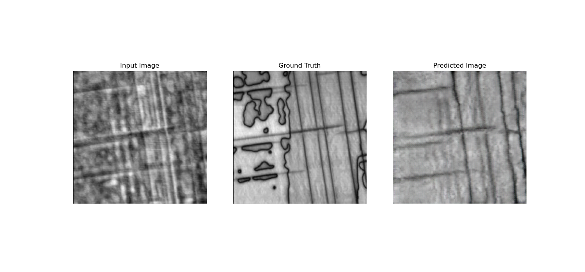
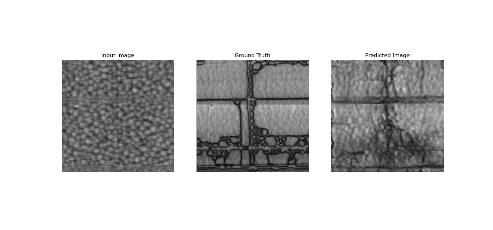

# Microscopy Hackathon: Team GANder

_Ralph Bulanadi (University of Geneva, Switzerland)_

_Kieran Pang (Justus-Liebig-Universität Gießen, Germany)_

_Michelle Wang (Technical University of Denmark, Denmark)_

## Background and Introduction

Ferroelectric materials spontaneously maintain an electric polarisation; ferroelastic materials spontaneously maintain an elastic strain. Many functional materials, such as lead titanate thin films (PbTiO3, PTO), simultaneously exhibit phases that are both ferroelectric and ferroelastic, and this combined ferroicity can be used extensively for transducer applications.

Ferroelectric polarisation can be readily observed at the nanoscale through piezoresponse force microscopy (PFM)—a variant of atomic-force microscopy (AFM) in which a scanning probe is placed in contact with a sample, an oscillating voltage is applied through the sample, and the consequent (piezoelectric) mechanical oscillations are read. However, the application of a voltage into the sample can cause ferroelectric switching, charge injection, or other chemical changes in the system. Further, the tip being placed in contact with the sample could change or alter the sample surface. Methods that can determine ferroelectric polarisations with neither an external bias, nor tip–sample contact, could therefore be particularly useful for the study of ferroelectric materials.

Here, we therefore investigate ferroelastic–ferroelectric PTO thin films that contain both c-domains (with an out-of-plane polarisation and out-of-plane tetragonal distortions) and a-domains (with an in-plane polarisation and similarly in-plane tetragonal distortions). As the domains have different polarisation axes and strain axes from one another, both domains appear distinct from each other in both AFM topography datasets and PFM amplitude datasets. We have trained a generative adversarial network (GAN) based on `pix2pix` [1] on both the Height and Amplitude channels of typical PFM measurements to encode such differences in a machine-learning model.

## Model

Our trained model can be found [here](https://knox.unige.ch:5000/d/s/11NadvozcMdZJEI5DxR7YVqBOOjqIrxA/lvRxhtMzlx6EWC2NeLkffDAeN22pO1uS-I7gguFYv6As)

## Code

Run notebooks in the following order to train a new model:

1. `createCompositeImageFromIBW.ipynb`: Converts all DART PFM `.ibw` files in current directory, and all sub-directories, into `.jpg` files in a new subfolder named `Raw_Data`. Then composes Height and Amplitude channels into a single `.jpg`. A single `.ibw` is currently supplied; please contact Ralph Bulanadi if more files are requested.
2. `dataset_augmentation.ipynb`: Augments `.jpg` data by rotation and cropping.
3. `TrainingOnAugmented`: Creates and trains a new model.

To test the current model:

1. `TestingOnAugmented`: Runs model on dataset.

## Results

Training outputs of the GAN run on Height channels create falsified Amplitude channels that visually resemble the initial height channels. A particularly ideal example is shown in Fig. 1. Here, the Height Channel (Input Image) shows some orthogonal striations that are attributed to _a_-domains. In the Amplitude Channel (Ground Truth), we observe orthogonal lines we attribute physically to small regions of ferroelastic–ferroelectric _a_-domains compared to the surround _c_-domains. We also observe curved regions of reversed out-of-plane _c_-axis-oriented polarisation (which maintain the same ferroelastic strain as other _c_-domain regions. In the Simulated Amplitude Channel (Predicted Image), we observe the orthogonal lines that we attribute to the ferroelastic–ferroelectric _a_-domains, but _not_ the purely ferroelectric reversed _c_-domains. This suggests that our model is indeed fully capable of measuring such ferroelastic–ferroelectric correlations.

Fig 1: Good example of image from test set.

A less ideal example is shown in Fig. 2. Once more, the Height Channel (Input Image) shows some orthogonal striations that are attributed to _a_-domains, while the Amplitude Channel (Ground Truth), shows both ferroelastic-ferroelectric _a_-domains and reversed out-of-plane _c_-axis-oriented polarisations. In the Simulated Amplitude Channel (Predicted Image), however, we see both _a_-domains _and_ _c_-domain reversal. This could suggest that the model is currently overfitted; many of the training datasets image similar regions as the test datasets, and so the model may attempt to match the test datasets too strongly to a dataset used for training. This could produce the reversed _c_-domains, even if there is no physical indication of such in the Height Channel. A larger training dataset with independent images could be used to mitigate these effects.

Fig. 2: Less ideal example of image from test set.

## Conclusions, Outlook, and Future Work

The present work shows some promise in extracting ferroelectric–ferroelastic correlations, but further advancements could be performed on our model. Beyond improved training data, hyperparameter optimisation [2] could also be performed to improve the quality of results. Alternative physics could also be observed and tested on; ferroelectric–_ferromagnetic_ correlations could be observe to study magnetoelectric applications, for example, or scanning-probe microscopy data could be correlated with second-harmonic generation microscopy or nano-x-ray diffraction to unveil new physics. Synthetic images may alsso be used to supplement additional data for classification or regression models, as is currently performed in medical research [3].

## Methods

***Sample and Image Preparation:*** PTO (140 nm)/SRO (20 nm)/STO (001) thin films were grown as previously detailed in Ref. [4]. In brief, five samples were grown simultaneously by pulsed laser deposition and bombarded with varying levels of He2+ ions. Piezoresponse force microscopy was then performed in dual AC resonance tracking mode using _OPUS_ OSCM-Pt tips in an _Asylum Research_ Cypher with a 500 mV drive voltage. Images varied in scale from approximately 2 μm to 10 μm.

***Preliminary Data Processing:*** `HeightRetrace` and `Amplitude2Retrace` channels were directly taken from the `.ibw` output files from the _Asylum Research_ software. These datasets were directly converted to grayscale `.jpg` files using the `gray` sequential colormap in the `matplotlib` Python package, and no further data processing, with the minimum height (amplitude) and maximum height (amplitude) set to black and white respectively. These `.jpg` files were then both rescaled to 256x256 pixels, and paired height and amplitude images were combined together to create a single 512x256 pixel image. These composited images were used for model training.

***Data Augmentation:*** Our initial 78 PFM images were quadrupled by rotation (± 20°, randomly sampled from a uniform distribution). Random cropping and jitter were further applied.

***Model Training:*** Training was performed on our augmented image dataset for 40000 steps, which took approximately 3.5 hrs. The loss continued to decay over the entirety of the training model (Fig. 3).

[Fig. 3]

## References

[1] Isola, Phillip, et al. "Image-to-image translation with conditional adversarial networks." _Proceedings of the IEEE conference on computer vision and pattern recognition._ 2017.

[2] Hölscher, Dirk, et al. "Pix2Pix hyperparameter optimisation prediction." _Procedia Computer Science_ 225 (2023): 1009-1018.

[3] Chen, Yizhou, et al. "Generative adversarial networks in medical image augmentation: a review." _Computers in Biology and Medicine_ 144 (2022): 105382.

[4] Bulanadi, Ralph, et al. "Interplay between Point and Extended Defects and Their Effects on Jerky Domain-Wall Motion in Ferroelectric Thin Films." _Physical Review Letters_ 133.10 (2024): 106801.

